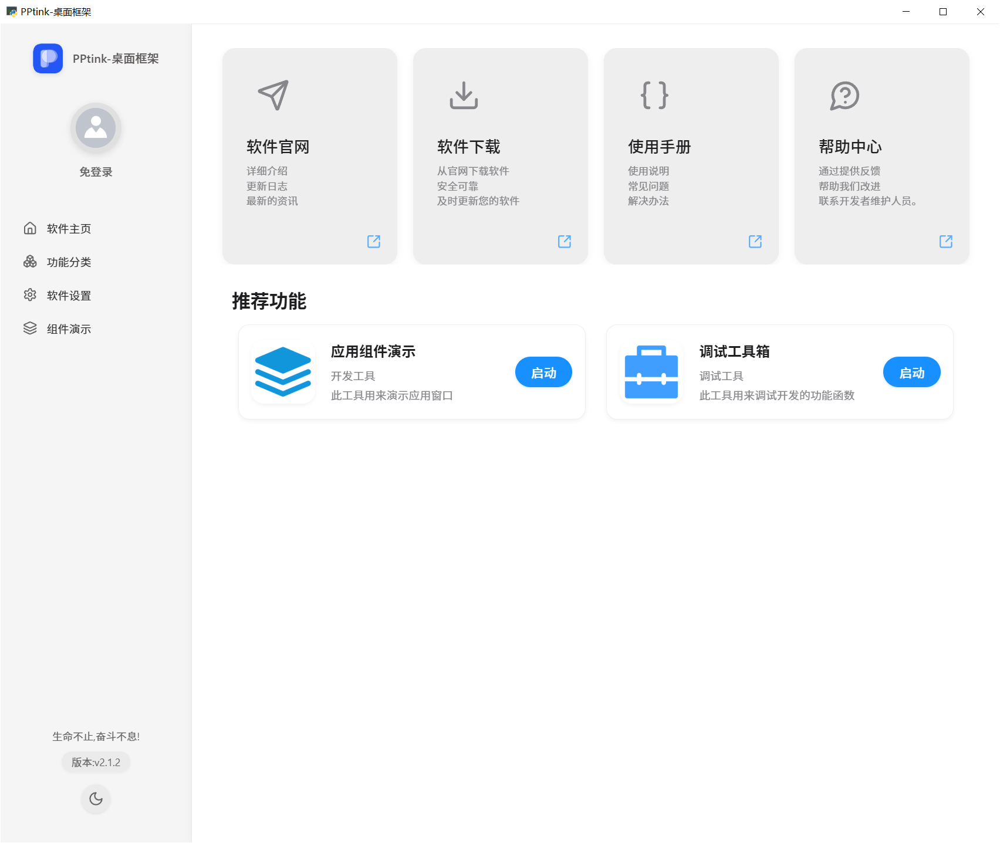
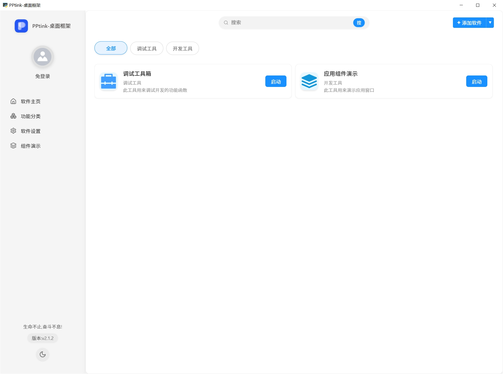
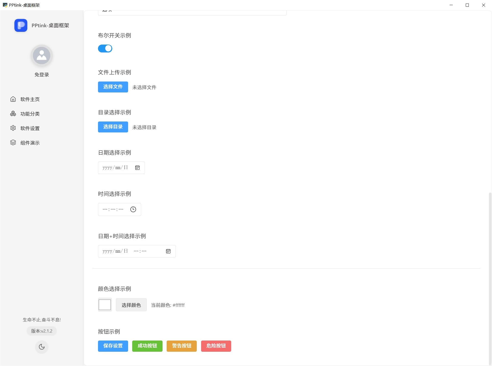
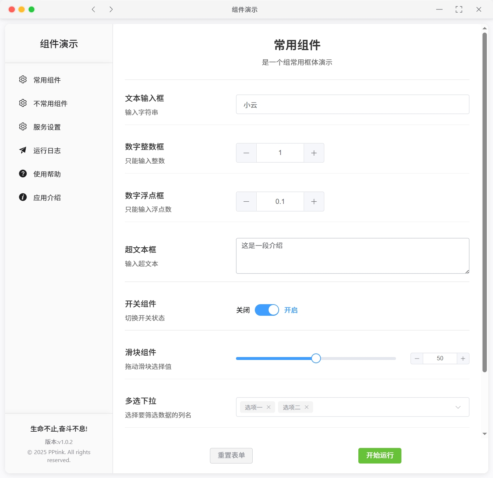
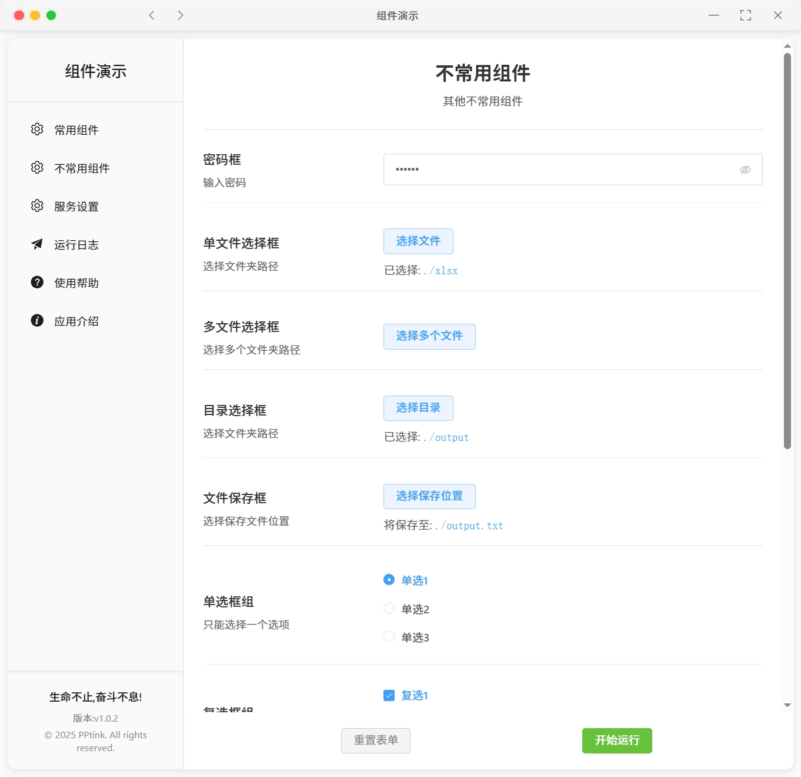
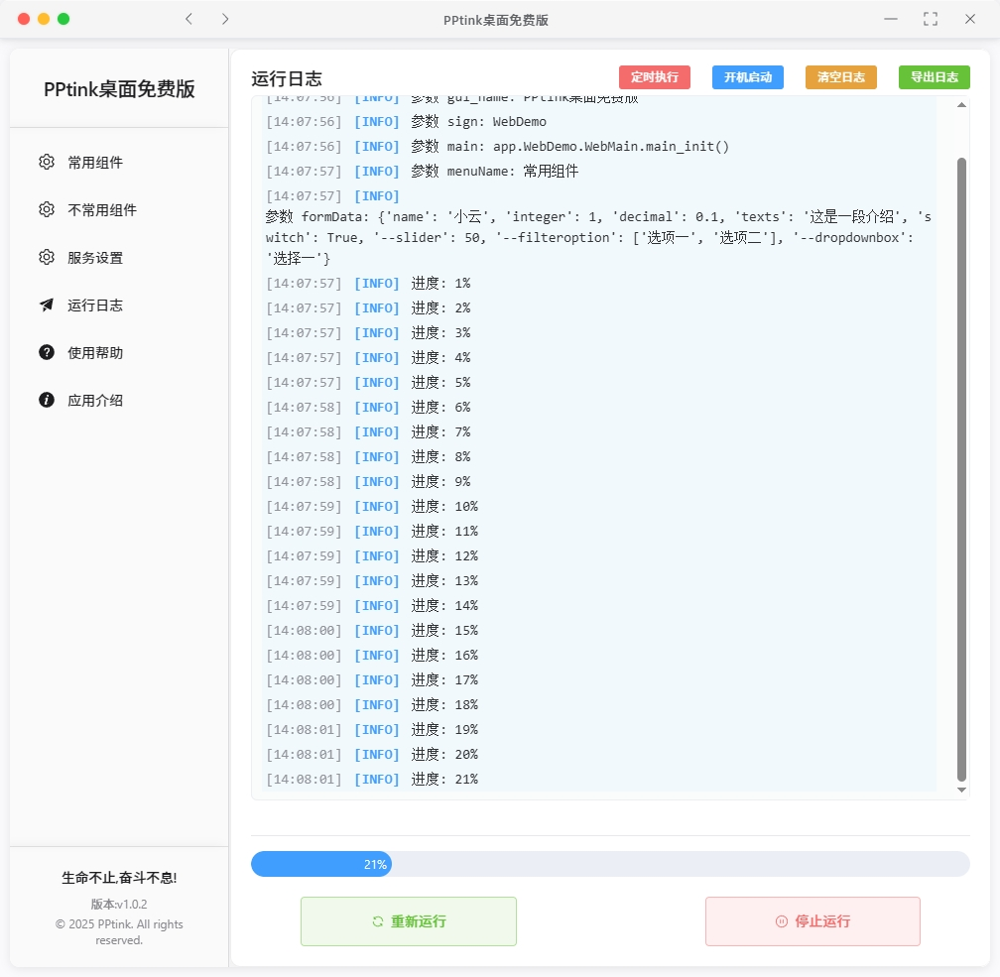
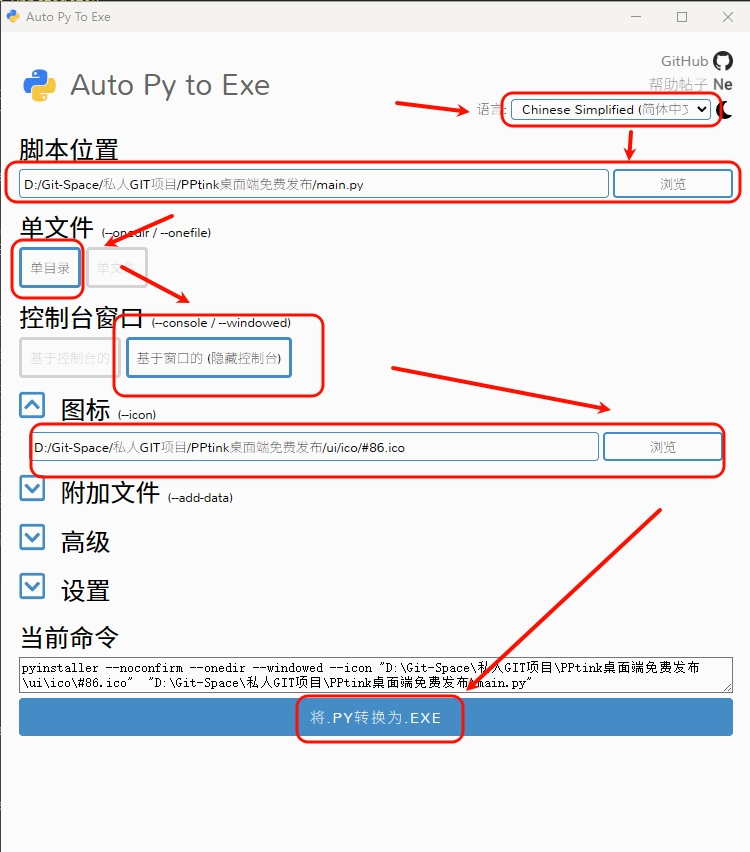
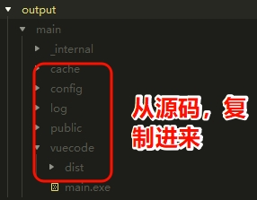

# PPtink桌面GUI框架 / PPtink Desktop GUI Framework

## 项目简介 / Project Introduction
官网/official website：[PPtink官网](https://gui.pengxukeji.cn)

开发手册/Development manual： [PPtink文档](https://gui.pengxukeji.cn/guide/)

视频演示 / Video Demonstration :  [视频演示](https://www.bilibili.com/video/BV1B754zdEFm)

github地址/GitHub address：[https://github.com/xike110/PPtink_GUI](https://github.com/xike110/PPtink_GUI)

gitee地址/Gitee address：[https://gitee.com/xiaoyun_admin/PPtink_GUI.git](https://gitee.com/xiaoyun_admin/PPtink_GUI.git)

PPtink是一个基于Python和Vue.js的现代化桌面GUI应用框架，通过WebView技术将Web前端界面与Python后端无缝集成，提供了优雅的用户界面和强大的功能扩展能力。该框架适用于快速开发跨平台桌面应用，具有界面美观、开发便捷的特点。

PPtink is a modern desktop GUI application framework based on Python and Vue.js. It seamlessly integrates web frontend interfaces with Python backend through WebView technology, providing elegant user interfaces and powerful extensibility. This framework is suitable for rapid development of cross-platform desktop applications with beautiful interfaces and convenient development experience.

## 项目预览 / Project Preview













## 技术栈 / Technology Stack

### 后端技术 / Backend Technologies
- **Python 3.10.10**: 核心开发语言 / Core development language

### 前端技术 / Frontend Technologies
- **Vue 3**: 前端框架，使用组合式API / Frontend framework with Composition API
- **TypeScript**: 类型安全的JavaScript超集 / Type-safe JavaScript superset
- **Element Plus**: UI组件库 / UI component library
- **Pinia**: Vue的状态管理库 / State management for Vue
- **Vite**: 现代前端构建工具 / Modern frontend build tool
- **SASS**: CSS预处理器 / CSS preprocessor
- **Vue Router**: Vue官方路由管理器 / Official Vue routing manager

## 主要功能 / Main Features

### 桌面应用框架 / Desktop Application Framework
- 无边框窗口设计，支持拖拽和自定义界面 / Borderless window design with drag support and customizable interface
- 系统托盘集成，支持最小化到托盘 / System tray integration with minimize-to-tray support
- 开机自启动选项 / Boot startup option
- 用户登录验证系统 / User login authentication system

### 前后端通信 / Frontend-Backend Communication
- JavaScript与Python双向通信机制 / Bidirectional communication between JavaScript and Python
- 自定义API接口，支持前端调用Python函数 / Custom API interfaces supporting frontend calls to Python functions
- 事件驱动架构，支持窗口事件监听和处理 / Event-driven architecture with window event listening and handling

### 系统功能 / System Features
- 配置文件管理 / Configuration file management
- 缓存系统 / Caching system
- 日志记录 / Logging system
- 网络连接检测 / Network connection detection
- 错误处理和用户提示 / Error handling and user notifications

### 安全特性 / Security Features
- SSL错误处理 / SSL error handling
- 用户认证与鉴权 / User authentication and authorization
- 接口安全控制 / API security control

## 开发指南 / Development Guide

### 环境要求 / Environment Requirements
- Python 3.10+
- Node.js 16+
- npm 8+

### pip 安装依赖库 / Install Dependencies with pip
```bash
python.exe -m pip install --upgrade pip
pip install pywebview
pip install pystray
pip install pyyaml
pip install diskcache
pip install requests
pip install pyinstaller
pip install auto-py-to-exe
pip install fastapi uvicorn
pip install psutil
pip install beautifulsoup4
pip install sqlalchemy
pip install pywin32
pip install schedule
```
### 配置软件界面参数 / Configure Software Interface
```
app/WebDemo/utils/conf.py
```
### 前端构建流程 / Frontend Build Process
```bash
npm install # 安装前端依赖 / Install frontend dependencies
npm run dev # 前端开发（Vue）/ Frontend development (Vue)
npm run build # 前端构建 / Frontend build
```

### 启动应用 / Start Application
```bash
python main.py
```

## 部署与分发 / Deployment and Distribution
支持将应用打包为独立可执行文件，方便分发与安装。

Supports packaging the application into standalone executable files for easy distribution and installation.
```bash
python auto-py-to-exe
```
打包设置



打包后复制 下面目录到打包的 output 目录下
```
[
    {
        "目录名": "缓存目录",
        "源码路径": "/cache",
        "迁移打包路径": "/output/main/cache",
    }, {
        "目录名": "日志目录",
        "源码路径": "/log",
        "迁移打包路径": "/output/main/log",
    }, {
        "目录名": "配置目录",
        "源码路径": "/config",
        "迁移打包路径": "/output/main/config",
    }, {
        "目录名": "demo应用静态目录",
        "源码路径": "/app/WebDemo/static",
        "迁移打包路径": "/output/main/_internal/app/WebDemo/static",
    }, {
        "目录名": "公共资源目录",
        "源码路径": "/public",
        "迁移打包路径": "/output/main/public",
    }, {
        "目录名": "VUE编译目录",
        "源码路径": "/vuecode/dist",
        "迁移打包路径": "/output/main/vuecode/dist",
    }
]

```
目录迁移复制



## 许可证 / License
[添加项目许可证信息 / Add project license information]

## 待完成任务 / TODO Tasks
```

```
## 快速开始组件 / Quick Start Components

app/WebDemo/RunCode.py

```Python
# 添加表单组件演示菜单
self.gui_config.add_menu("常用组件", "是一个组常用框体演示")
# --------------------------添加基本输入框分组-------------------------------------
self.gui_config.add_argument_group("基本输入框(分组)", description="基本的输入控件", gooey_options={"show_border": True, "columns": 2})

# 文本输入框
self.gui_config.add_argument(
    "name",
    metavar="文本输入框",
    help="输入字符串",
    default="小云",
    widget="TextField",
    validate="customize_verify",
    gooey_options={
        "placeholder": "请输入您的名称",  # 占位文本
        "maxlength": 50,  # 最大长度
        "minlength": 2,  # 最小长度
        "readonly": False,  # 是否只读
        "disabled": False,  # 是否禁用
        "clearable": True,  # 是否可清空
        "showWordLimit": True,  # 是否显示字数限制
        "prefixIcon": "User",  # 前缀图标
        "size": "large"  # 大小 large/default/small
    },
)

# 数字整数框
self.gui_config.add_argument(
    "integer",
    metavar="数字整数框",
    help="只能输入整数",
    type=int,
    default=1,
    widget="IntegerField",
    validate="integer_verify",
    gooey_options={
        "min": 0,  # 最小值
        "max": 100,  # 最大值
        "step": 1,  # 步长
        "stepStrictly": False,  # 是否只能输入步长的倍数
        "controls": True,  # 是否显示控制按钮
        "controlsPosition": "right",  # 控制按钮位置
        "placeholder": "请输入整数",  # 占位文本
        "size": "large"
    }
)

# 浮点数框
self.gui_config.add_argument(
    "decimal",
    metavar="数字浮点框",
    help="只能输入浮点数",
    default=0.1,
    widget="DecimalField",
    gooey_options={
        "min": -5.0,  # 最小值
        "max": 5.0,  # 最大值
        "step": 0.1,  # 步长
        "precision": 2,  # 精度，小数位数
        "controls": True,  # 是否显示控制按钮
        "placeholder": "请输入浮点数",  # 占位文本
        "size": "large"

    }
)

# 文本域
self.gui_config.add_argument(
    "texts",
    metavar="超文本框",
    help="输入超文本",
    default="这是一段介绍",
    widget="Textarea",
    gooey_options={
        "height": 100,  # 高度
        "width": 200,  # 宽度
        "readonly": False,  # 是否只读
        "autosize": {"minRows": 3, "maxRows": 6},  # 自动调整大小
        "maxlength": 500,  # 最大长度
        "showWordLimit": True,  # 是否显示字数限制
        "placeholder": "请输入详细描述",  # 占位文本
        "resize": "both",  # none, both, horizontal, vertical
        "size": "large"
    }
)

# 开关组件
self.gui_config.add_argument(
    "switch",
    metavar="开关组件",
    help="切换开关状态",
    default=True,
    widget="SwitchField",
    gooey_options={
        "activeValue": True,  # 打开时的值
        "inactiveValue": False,  # 关闭时的值
        "activeText": "开启",  # 打开时的文字
        "inactiveText": "关闭",  # 关闭时的文字
        "activeColor": "#13ce66",  # 打开时的颜色
        "inactiveColor": "#ff4949",  # 关闭时的颜色
        "width": 60,  # 宽度
        "size": "large",  # 大小
        "inlinePrompt": False,  # 是否在按钮中显示文字
        "disabled": False  # 是否禁用
    }
)

# 滑块组件
self.gui_config.add_argument(
    "--slider",
    metavar="滑块组件",
    help="拖动滑块选择值",
    default=50,
    widget="SliderField",
    gooey_options={
        "min": 0,  # 最小值
        "max": 100,  # 最大值
        "step": 1,  # 步长
        "showInput": True,  # 是否显示输入框
        "showStops": False,  # 是否显示间断点
        "showTooltip": True,  # 是否显示提示
        "range": False,  # 是否为范围选择
        "vertical": False,  # 是否垂直模式
        "height": "200px",  # 高度
        "marks": {0: "0%", 25: "25%", 50: "50%", 75: "75%", 100: "100%"},  # 标记点
        "disabled": False,  # 是否禁用
        "size": "large"
    }
)

# --------------------------下拉分组-------------------------------------
self.gui_config.add_argument_group("选择下拉(分组)", gooey_options={"show_border": True, "columns": 2})

# 多选下拉框
self.gui_config.add_argument(
    "--filteroption",
    metavar="多选下拉",
    help="选择要筛选数据的列名",
    choices=["选项一", "选项二", "选项三", "选项四", "选项五"],
    required=True,
    widget="Listbox",
    nargs="*",
    default=["选项一", "选项二"],
    gooey_options={
        "full_width": True,  # 是否占满宽度
        "height": 100,  # 高度
        "filterable": True,  # 是否可搜索
        "collapseTags": True,  # 是否折叠标签
        "collapseTagsTooltip": True,  # 是否在折叠标签时显示tooltip
        "placeholder": "请选择多个选项",  # 占位文本
        "multipleLimit": 0,  # 0表示不限制
        "size": "large"  # 大小
    }
)

# 单选下拉框
self.gui_config.add_argument(
    "--dropdownbox",
    metavar="单选下拉框",
    help="选择你需要的",
    choices=["选择一", "选择二", "选项三", "选项四", "选项五"],
    default="选择一",
    widget="Dropdown",
    gooey_options={
        "filterable": True,  # 是否可搜索
        "placeholder": "请选择一个选项",  # 占位文本
        "clearable": True,  # 是否可清空
        "remote": False,  # 是否为远程搜索
        "loading": False,  # 是否加载中
        "loadingText": "加载中...",  # 加载中文本
        "noMatchText": "无匹配数据",  # 无匹配文本
        "noDataText": "无数据",  # 无数据文本
        "reserveKeyword": True,  # 是否保留搜索关键字
        "size": "large"  # 大小
    }
)

# -------------------------------------------------------------------
#                   导航-其他组件
# -------------------------------------------------------------------
# 添加组合布局演示菜单
self.gui_config.add_menu("不常用组件", "其他不常用组件")

# 密码框
self.gui_config.add_argument(
    "password",
    metavar="密码框",
    help="输入密码",
    default="123456",
    widget="PasswordField",
    gooey_options={
        "showPassword": True,  # 是否显示密码切换按钮
        "placeholder": "请输入密码",  # 占位文本
        "clearable": True,  # 是否可清空
        "maxlength": 20,  # 最大长度
        "minlength": 6,  # 最小长度
        "size": "large",  # 大小
        "prefixIcon": "Lock",  # 前缀图标
        "autocomplete": "off"  # 自动完成
    }
)

# --------------------------文件目录选择框分组-------------------------------------
self.gui_config.add_argument_group("文件目录选择框(分组)", gooey_options={"show_border": True, "columns": 2})

# 单文件选择框
self.gui_config.add_argument(
    "--Filepath",
    metavar="单文件选择框",
    help="选择文件夹路径",
    type=str,
    default="./xlsx",
    widget="FileChooser",
    gooey_options={
        "buttonText": "选择文件",  # 按钮文本
        "plain": True,  # 是否为朴素按钮
        "size": "large",  # 大小
        "buttonIcon": "Document",  # 按钮图标
        "disabled": False  # 是否禁用
    }
)

# 多文件选择框
self.gui_config.add_argument(
    "--allpath",
    metavar="多文件选择框",
    help="选择多个文件夹路径",
    nargs="+",
    widget="MultiFileChooser",
    gooey_options={
        "buttonText": "选择多个文件",  # 按钮文本
        "plain": True,  # 是否为朴素按钮
        "size": "large",  # 大小
        "buttonIcon": "Files",  # 按钮图标
        "disabled": False  # 是否禁用
    }
)

# 目录选择框
self.gui_config.add_argument(
    "--outputDirectory",
    metavar="目录选择框",
    help="选择文件夹路径",
    type=str,
    default="./output",
    widget="DirChooser",
    gooey_options={
        "buttonText": "选择目录",  # 按钮文本
        "plain": True,  # 是否为朴素按钮
        "size": "large",  # 大小
        "buttonIcon": "Folder",  # 按钮图标
        "disabled": False  # 是否禁用
    }
)

# 文件保存框
self.gui_config.add_argument(
    "--saveFile",
    metavar="文件保存框",
    help="选择保存文件位置",
    type=str,
    default="./output.txt",
    widget="FileSaver",
    gooey_options={
        "buttonText": "选择保存位置",  # 按钮文本
        "plain": True,  # 是否为朴素按钮
        "size": "large",  # 大小
        "buttonIcon": "Save",  # 按钮图标
        "disabled": False  # 是否禁用
    }
)

# --------------------------单选复选分组-------------------------------------
self.gui_config.add_argument_group("单选复选(分组)", gooey_options={"show_border": True, "columns": 2})

# 单选框组
self.gui_config.add_argument(
    "--radio",
    metavar="单选框组",
    help="只能选择一个选项",
    choices=["单选1", "单选2", "单选3"],
    default="单选1",
    widget="RadioGroup",
    gooey_options={
        "direction": "horizontal",  # 方向 vertical/horizontal
        "size": "large",  # 大小 large/default/small
        "disabled": False,  # 是否禁用
        "textColor": "#ffffff",  # 文本颜色
        "fill": "#409EFF"  # 填充色
    }
)

# 复选框组
self.gui_config.add_argument(
    "--checkbox",
    metavar="复选框组",
    help="可以选择多个选项",
    choices=["复选1", "复选2", "复选3"],
    default=["复选1", "复选2"],
    widget="BlockCheckbox",
    gooey_options={
        "direction": "vertical",  # 方向 vertical/horizontal
        "min": 1,  # 最少选择数量
        "max": 2,  # 最多选择数量
        "size": "large",  # 大小
        "disabled": False  # 是否禁用
    }
)

# --------------------------日期时间分组分组-------------------------------------
self.gui_config.add_argument_group("时间日期(分组)", gooey_options={"show_border": True, "columns": 2})

# 日期选择器
self.gui_config.add_argument(
    "--date",
    metavar="日期",
    help="选择日期",
    default="2024-06-14",
    widget="DateChooser",
    gooey_options={
        "dateType": "date",  # 日期类型 date/dates/week/month/year/years
        "format": "YYYY-MM-DD",  # 格式化
        "valueFormat": "YYYY-MM-DD",  # 值格式化
        "placeholder": "选择日期",  # 占位文本
        "clearable": True,  # 是否可清空
        "editable": True,  # 是否可编辑
        "size": "large",  # 大小
        "disabled": False  # 是否禁用
    }
)

# 时间选择器
self.gui_config.add_argument(
    "--time",
    metavar="时间",
    help="选择时间",
    default="13:14:22",
    widget="TimeChooser",
    gooey_options={
        "format": "HH:mm:ss",  # 格式化
        "valueFormat": "HH:mm:ss",  # 值格式化
        "placeholder": "选择时间",  # 占位文本
        "clearable": True,  # 是否可清空
        "editable": True,  # 是否可编辑
        "size": "large",  # 大小
        "disabled": False,  # 是否禁用
        "isRange": False,  # 是否为范围选择
        "arrowControl": True  # 是否使用箭头进行时间选择
    }
)

# 日期时间选择器
self.gui_config.add_argument(
    "--datetime",
    metavar="日期时间",
    help="选择日期时间",
    default="2024-06-14 13:14:22",
    widget="DateTime",
    gooey_options={
        "dateTimeType": "datetime",  # 日期时间类型 datetime/datetimerange
        "format": "YYYY-MM-DD HH:mm:ss",  # 格式化
        "valueFormat": "YYYY-MM-DD HH:mm:ss",  # 值格式化
        "placeholder": "选择日期和时间",  # 占位文本
        "clearable": True,  # 是否可清空
        "editable": True,  # 是否可编辑
        "size": "large",  # 大小
        "disabled": False  # 是否禁用
    }
)

# --------------------------添加颜色选择器-------------------------------------
self.gui_config.add_argument_group("颜色选择器(分组)", gooey_options={"show_border": True, "columns": 1})

# 颜色选择器
self.gui_config.add_argument(
    "--color",
    metavar="颜色选择器",
    help="选择颜色",
    default="#409EFF",
    widget="ColourChooser",
    gooey_options={
        "showAlpha": True,  # 是否支持透明度选择
        "colorFormat": "hex",  # 颜色格式 hex/rgb/hsl
        "predefine": ["#409EFF", "#67C23A", "#E6A23C", "#F56C6C", "#909399"],  # 预定义颜色
        "size": "large",  # 大小
        "disabled": False  # 是否禁用
    }
)

# -------------------------------------------------------------------
#                   导航-启动服务设置
# -------------------------------------------------------------------
# 添加表单组件演示菜单
self.gui_config.add_menu("服务设置", "是一个启动服务的设置")
self.gui_config.add_argument(
    "port",
    metavar="服务端口",
    help="输入启动服务的端口",
    type=int,
    default=8080,
    widget="IntegerField",
    gooey_options={
        "min": 0,  # 最小值
        "max": 10000,  # 最大值
        "step": 1,  # 步长
        "stepStrictly": False,  # 是否只能输入步长的倍数
        "controls": True,  # 是否显示控制按钮
        "controlsPosition": "right",  # 控制按钮位置
        "placeholder": "请输入整数",  # 占位文本
        "size": "large"

    }
)
# 返回当前配置
return self.gui_config.to_dict()
```
v